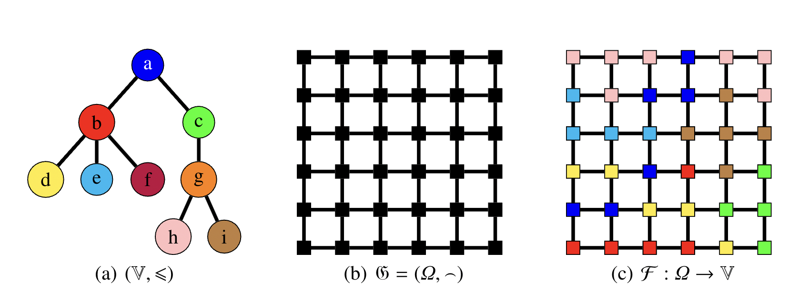
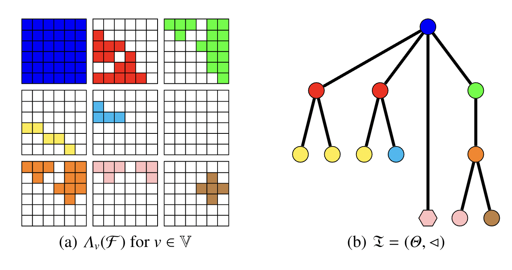
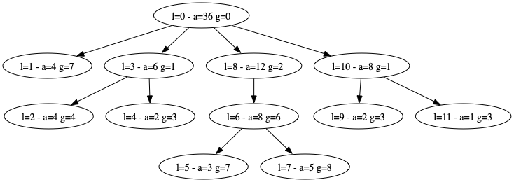
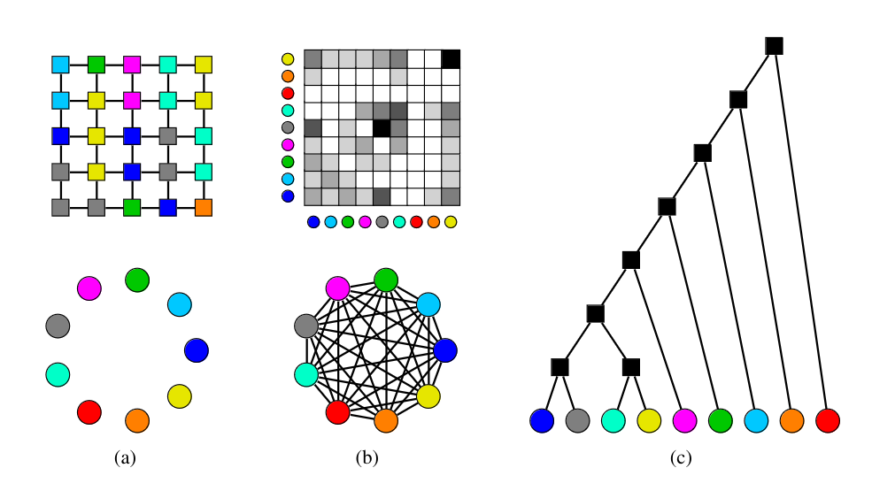
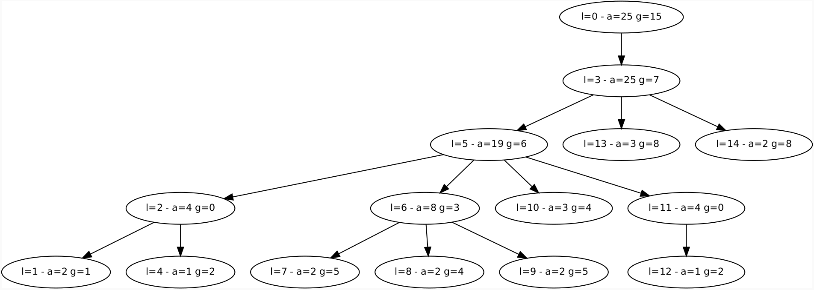

# Multivalued component-trees (MCT)

This repository contains the code for the paper *New algorithms for multivalued component-trees* by Nicolas Passat, Romain Perrin, Jimmy Francky Randrianasoa, Camille Kurtz, and Benoît Naegel. 

Two examples are presented here :

- <a href="#example1">MCT from the image of <b> Figure 1 </b></a>
- <a href="#example2">MCT from the image of <b> Figure 6 </b></a>

## Installation

The code is written in Python and requires the following libraries:
- numpy
- pydot

## MCT from the image of Figure 1 <a id="example1"></a>

### Usage

The command :
```bash
python3 mct_fig1.py 
```
will run the code on the image of depicted on <b>Figure 1</b> of the paper and output the multivalued component-tree in dot format in the file `mct_fig1.dot`.
The tree can be visualized using for example the command:
```bash
dot -Tpdf mct_fig1.dot -o mct_fig1.pdf
```
which produces a graphical representation of the tree in pdf format.
or using any tiers software that can read dot files.



(a) the hierarchical ordering of labels, (b) the adjacency graph, and (c) the input image F



(a) the threshold sets of F, (b) the multivalued component-tree of F



The produced MCT using the proposed algorithm.
Each node is described by:

- l: the unique identifier of the node
- a: the area (number of pixels) of the node
- g: the value of the  node, represented by an integer index based on the following mapping :
    - 0: a
    - 1: b
    - 2: c
    - 3: d
    - 4: e
    - 5: f
    - 6: g
    - 7: h
    - 8: i

## MCT from the image of Figure 6 <a id="example2"></a>

### Usage

The command :
```bash
python3 mct_fig6.py 
```
will run the code on the image of depicted on <b>Figure 6</b> of the paper and output the multivalued component-tree in dot format in the file `mct_fig6.dot`.

This example requires a hierarchical order on an enriched set of values. The `bpt_labels_fig6.dot` has been built as described in the <b>Section 5.2: Ordering the enriched value set</b> of the paper. The code is available at <a href="https://github.com/jimmy-randrianasoa/Example_BinaryPartitionTree_ValueSet.git" target="_blank">Example_BinaryPartitionTree_ValueSet</a>.

The MCT can be visualized using for example the command:
```bash
dot -Tpdf mct_fig6.dot -o mct_fig6.pdf
```
which produces a graphical representation of the tree in pdf format.
or using any tiers software that can read dot files.



(a) Top: the image. Bottom: set of 9 values. (b) Top: the co-occurrence matrix of the image. Bottom: the set is endowed with an adjacency. (c) Binary partition tree as a hierarchical order on an enriched set of values.



The produced MCT using the proposed algorithm.
Each node is described by:

- l: the unique identifier of the node
- a: the area (number of pixels) of the node
- g: the value of the  node, represented by an integer index based on the following mapping :
    -  &nbsp; 0: &nbsp; 9
    -  &nbsp; 1: &nbsp; 0 &nbsp;&nbsp;&nbsp;(as blue)
    -  &nbsp; 2: &nbsp; 4 &nbsp;&nbsp;&nbsp;(as gray)
    -  &nbsp; 3: 10
    -  &nbsp; 4: &nbsp; 5 &nbsp;&nbsp;&nbsp;(as cyan)
    -  &nbsp; 5: &nbsp; 8 &nbsp;&nbsp;&nbsp;(as yellow)
    -  &nbsp; 6: 11
    -  &nbsp; 7: 12
    -  &nbsp; 8: &nbsp; 2 &nbsp;&nbsp;&nbsp;(as green)
    -  &nbsp; 9: 13
    - 10: &nbsp; 3 &nbsp;&nbsp;&nbsp;(as fuchsia)
    - 11: 14
    - 12: &nbsp; 1 &nbsp;&nbsp;&nbsp;(as light blue)
    - 13: 15
    - 14: &nbsp; 7 &nbsp;&nbsp;&nbsp;(as orange)
    - 15: 16
    - 16: &nbsp; 6 &nbsp;&nbsp;&nbsp;(as red)